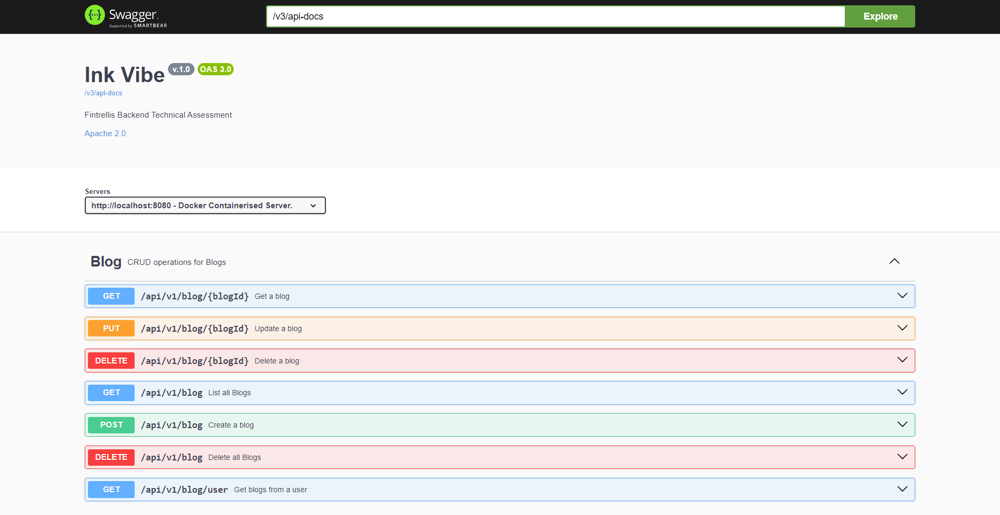

# [](https://github.com/githiomi/InkVibe) INK VIBE

> Developed by <a href="httpS://github.com/githiomi">Daniel Githiomi</a>

## Table of contents
><details>
><summary>Quick Find</summary>
><ol>
><li><a href="#description">Description</a></li>
><li><a href="#preview">Preview</a></li>
><li><a href="#authentication">Authentication</a></li>
><li><a href="#technologies">Technologies</a></li>
><li><a href="#justification">Justification</a></li>
><li><a href="#requirements">Requirements</a></li>
><li><a href="#installation">Installation</a></li>
><li><a href="#maintainers">Maintainers</a></li>
><li><a href="#contact">Contact</a></li>
><li><a href="#licenses">Licenses</a></li>
></ol>
></details>

## DESCRIPTION

This is a REST API built using Java SpringBoot Framework. It is a technical assessment given by **Fintrellis** tasked to develop a CRUD REST API for a blog to incorporate creating, reading, updating and deleting functionality. The API is also designed to handle user authentication using Spring Security.

An __ANGULAR__ application is being **developed** as a frontend to interact with this REST API.

## PREVIEW

The application can be tested using the following resources:
- Postman
- Web Browser (Chrome, Firefox, etc...)
- [Swagger UI (Local)](http://localhost:9000/swagger-ui/index.html)
- [Swagger UI (Docker)](http://localhost:8080/swagger-ui/index.html) 

Preview Below...



## AUTHENTICATION

The API requires that the Android application sends valid credentials for authentication. The authentication process uses token-based authentication (JWT) to verify users and manage session states.

The application was developed with the use of **Spring Security** and therefore requires authentication.

This Security layer protects the API but allows access to the following:
- [H2 Database Console](http://localhost:9000/h2)
- [Swagger UI Documentation](http://localhost:9000/swagger-ui/index.html)

#### Valid credentials:

Where prompted, user the following credentials:

| Username | Password |
|----------|----------|
| admin    | admin123 |

## TECHNOLOGIES

Below are some of the technologies used in the development:

- Java v21
- SpringBoot v3.4.1
- H2 Database
- JPA Repository
- Spring Security
- Lombok
- Swagger UI

## JUSTIFICATION

- `H2 Database`
  - The Lightweight H2 Database was used because the application requirements were not demanding and H2 was able to handle data
  - For easy installation on local machines because no further setup or configuration for an external Database is required.
- `Java`
  - Java is a stable programming language with a lot of frameworks and libraries that make the development easier and faster.
  - Third party libraries make development easier and reduce the amount of code required.
- `JPA Repository`
  - This was used because it provides the database functionality of quickly adding records to a database.
  - Reduces the amount of boilerplate code needed for database connectivity.

## REQUIREMENTS

The machine to be used requires the following to be installed and set up:

* Java (Version 17 or higher)
* Docker
* Maven (Optional)

## INSTALLATION

Installation can be done in 2 ways:

- Docker
  - Build the DockerFile to create an image
    ```shell
    docker build -t inkvibe:1.0 .
    ```
  - Run the Docker Image
    ```shell
    docker run -p 8080:9000 inkvibe:latest
    ```
  - Access the application using [Docker Local Host](http://localhost:8080/api/v1/blog)
    
  - Local
    - Git clone [this](https://github.com/githiomi/InkVibe) repository
    - Open your preferred IDE (__Intellij__ is recommended).
    - Run __maven__ to install all dependencies.
    - Run __maven install__ to create a jar file
    - Launch the application
      - Press the play button at Intellij toolbar
      - Or run the following in CMD in the application root directory
      ```shell
      java -jar InkVibe-0.0.1-SNAPSHOT.jar
      ```

## MAINTAINERS

- [Daniel Githiomi (Dhosio)](https://github.com/githiomi)

## CONTACT

Contact me through any of the following channels:

* Website: [portfolio](https://danielgithiomi.com)
* GitHub: [githiomi](https://github.com/githiomi)
* LinkedIn: [danielgithiomi](https://linkedin.com/in/daniel-githiomi/)
* Email: [gmail](danielgithiomi@gmail.com)

## LICENSES

Click the following to access my license page: [License](https://githiomi.github.io/Privacy-Policy/)

> Copyright (c) {2024} DhosioLux.